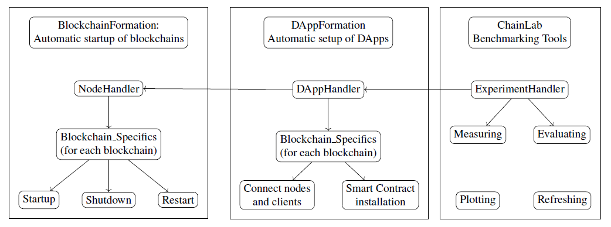

# DLPS: A Blockchain Performance Evaluation Framework
DLTs promise to revolutionize business ecosystems by permitting secure transactions without intermediaries. A widely recognized challenge that inhibits the uptake of DLT is scalability and performance. Quantifying the performance and scalability of DLT is crucial for designing DLT-based infrastructures, applications, and ecosystems, and thus, for their adoption in business and public services. 

In this repository, we present the Distributed Ledger Performance Scan (DLPS), a comprehensive framework for performance characterizations and benchmarking of blockchains, addressing the need to evaluate highly customizable workloads and configurations

## Paper 
The according paper describing the architecture and the functionality of the framework can be found here:
https://scholarspace.manoa.hawaii.edu/handle/10125/71443

## Uses Blockchain Networks generated by BlockchainFormation:
This repository uses BlockchainFormation to set up the different blockchain networks in aws. Note that created networks are all in the same aws subnet and do not adhere to security requirements needed for productive networks, therefore do not use these networks for productive environments.

## Architecture



## Usage

### Run Benchmarking
To run ChainLab you need to provide a config with all needed configuration parameters for the blockchain, the clients and the experiments.
 Example configs can be found in ```/src/example_configs/public_vpc``` and ```/src/example_configs/private_vpc```. In order to make them run you need to fill in your aws configurations (subnet, security group, ssh keyname, ...)

A example usage for Geth is:

```python src/run.py --config /src/example_configs/fabric_config.json```

##### Supported Blockchains
Currently, the following blockchains are supported:
* Hyperledger Fabric (very sophisticated)
* Ethereum with Geth and Parity client (very sophisticated)
* Hyperledger Indy (sophisticated)
* Quorum with RAFT and IBFT consensus (very sophisticated)
* Hyperledger Sawtooth (very sophisticated)

In order to have some centralized baseline, we also integrated
* CouchDB (single and cluster)
* LevelDB


##### Supports multiple Experiment parameters:
* [See Experimental Design](docs/experimental_design.md)

##### Performance Metrics
* Effectivity
* Latency
* Throughput
* Memory usage
* CPU usage (mpstat)
* memory (vmstat)
* disk utilization (iostat) 
* network latencies (ping)
* network traffic (ifstat)

After starting the run script with a correct config file, aws ec2 instances for the DLT network as well as the client will be started.
Afterwards all necessary packages and script will be installed on the ec2 instances. 
Now, the benchmarking runs can be started. This process can take a while, but the console is logging the current progress as well as creating plots which you can find in the directory created by the benchmarking script.
After the benchmarking is finished, all ec2 instances are terminated.


# How to install BlockchainFormation package

1. Clone Repo

2. cd into directory
```
cd BlockchainFormation
```

Now it should like this:
```
ls
> BlockchainFormation	MANIFEST.in		README.MD		setup.py
```

3. Build Dist
```
python setup.py sdist bdist_wheel
```

4. Install Package via pip 
```
pip install dist/BlockchainFormation-0.0.1.tar.gz 
```

 5. Other package which one has to install:
  See [requirements.txt](requirements.txt)
  
## License

[Apache License 2.0](LICENSE)
 
